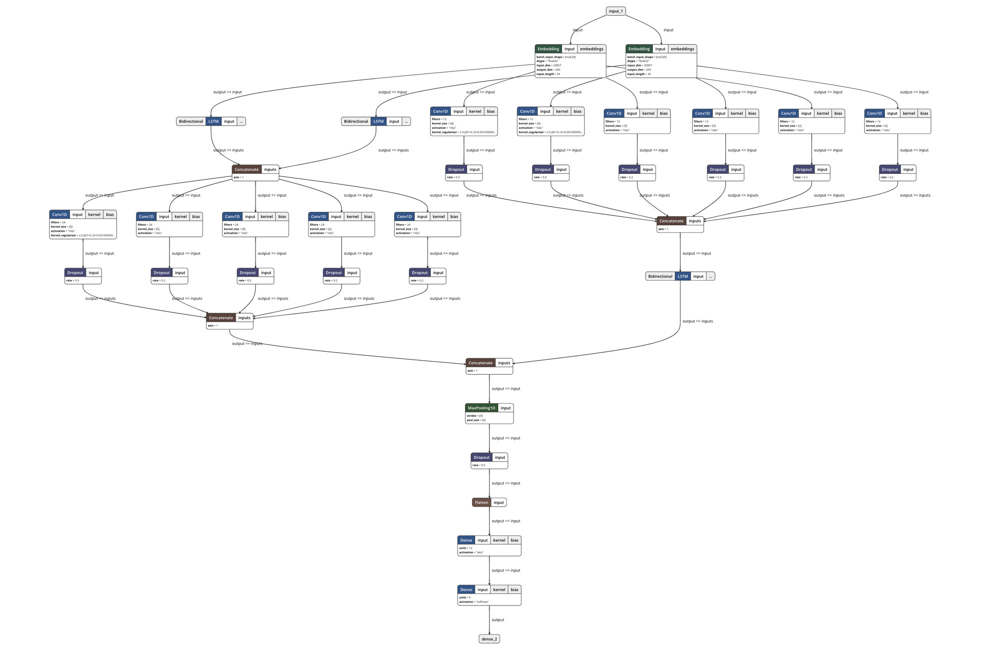

# Language Models for Chatbot

## 1. Currently what we have:

### 1.1 General Sentence Embedding
Currently we are using the [Universal Sentence Embedding](https://tfhub.dev/google/universal-sentence-encoder/2) model 
from Tensorflow Hub. 

A potential substitution can be [BERT](https://github.com/google-research/bert) released by Google recently.

### 1.2 Topic Model and Similarity-Based Retrieval

The topic model is now formulated by an *Image2Class*-like fashion due to the limited resources from tony.

Responses are retrieved according to the L2 norm of the sentence embedding shown in 1.1. 

*However, it is not purely 
determined by embedding distances since we also have stuffs like emotion and body language models.*

### 1.3 Sentiment and Emotion of Text

Text sentiment and emotion classification model that we are using is independent of the embeddings, which is built 
based on a mixture of CNNs and LSTMs. Details are provided [here](https://github.com/tlkh/text-emotion-classification).

Training data for this model are to somehow identical to the ones used by the original authors of this model (please do 
correct me if I misunderstood).

### 1.4 Fallback Response Generation

We are using a [Seq2Seq](https://arxiv.org/abs/1703.03906) + [attention](https://arxiv.org/abs/1508.04025) 
model very similar to the one discussed in the 
[Pytorch Chatbot Tutorial](https://pytorch.org/tutorials/beginner/chatbot_tutorial.html), with minor modification on
the decoder.

Training set includes some parts of the following corpuses:
* [Cornell Movie-Dialogs Corpus](https://www.cs.cornell.edu/~cristian/Cornell_Movie-Dialogs_Corpus.html)
* [Twitter](https://github.com/Marsan-Ma/twitter_scraper)
* [CommonSense](?)
* Something from Reddit
* etc.

For now, the model is not able to handle multi-turn conversations, and not all listed datasets support multi-turn 
conversational training.